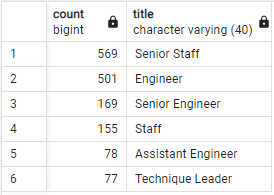
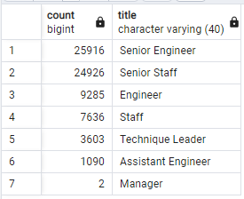
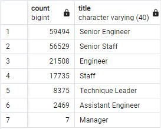

# Pewlett-Hackard-Analysis
## Project Overview
The purpose of this project is to query a company's employee database using PostgreSQL to determine the number of retirement eligible employees by job title and identify employees eligible to participate in a mentorship program. 

## Project Results
The two analysis results identified the following four major points:
- Approximately 70% of retirement eligible employees are either Senior Engineers or Senior Staff.
- Only 2 of the retirement eligible employees are managers which appears very low and may either be to an issue in the data or for some reason managers are not staying as managers until retirement.
- There are a total of 1,549 employees currently eligible for the mentorship program.
- Of eligible mentees, there are currently a total of 1,070 that are either Senior Engineers or Senior staff, whom may help address the void left by the senior retirees.

## Project Summary
- To prepare for the incoming retirement wave, the company will need to fill primarily 6 different roles with at least 1,000 retirees (Senior Engineer, Senior Staff, Engineer, Staff, Technique Leader, and Assistant Engineer). These 6 roles combined have a total of 72,456 employees.

- There are currently a total of 166,117 upcoming future leaders that are not yet retirement eligible and were born between 1/1/1956 and 12/31/1964. The retirement eligible group can mentor this next generation group if each retiree mentored between 2-3 employees.

